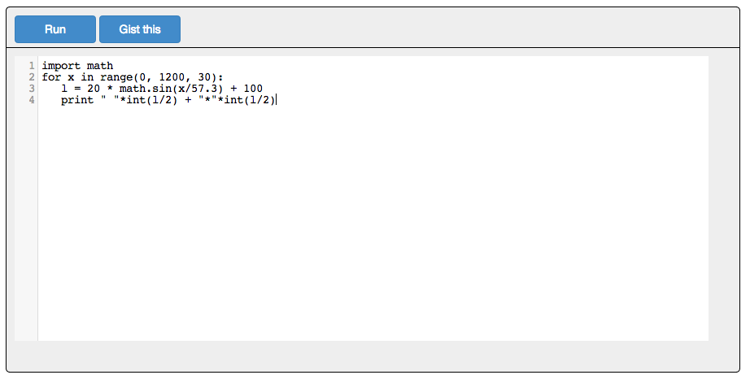

# O'Reilly Atlas CodeRunner

This project transforms [O'Reilly Atlas](https://atlas.oreilly.com/) markup like this:

```html
<pre data-executable="true" data-language="python">
import math
for x in range(0, 1200, 30):
   l = 20 * math.sin(x/57.3) + 100
   print " "*int(l/2) + "*"*int(l/2)
</pre>
```

Into a browser plugin where you can run the code, like this:

</img>

The plugin provides:

* [CodeMirror](https://github.com/marijnh/codemirror) for editing code sample.
* [JSREPL](https://github.com/replit/jsrepl) for running the code sample.  There are many caveats on what you can do with this tool, but it is awesome.
* [JQconsole](https://github.com/replit/jq-console) for viewing the output and providing a basic REPL for the selected language. (More on this in a bit)

These will allow you to:

* Transform code samples (with caveats!) in Atlas into a live example in your project
* Edit the code samples in a nice editor
* Click "Run" to execute the code
* Interact with the code in a console, including accepting user input (i.e., use Ruby's _gets_ or Python's _input_ and doing something with the result.)
* Running general commands in a REPL

Many thanks for [Geert Kapteijns](http://kapteijns.org/) awesome post [Interactive Ruby in the browser](http://kapteijns.org/2014/03/21/ruby-repl-in-javascript.html) for showing how to put JSREPL and JQ-CONSOLE together.

# Still to do

* Figure out multiline input
* Make this easy to install in Atlas; like, maybe this should be an NPM package or something
* figure out why jqconsole adds a newline before the user input prompt
* get jsrepl itself on a CDN
* Implement the gist button 
* Break out of an infinite loop (like, how to do ctrl+c)
* stop coderunner from grabbing the focus when the page loads
* Save the output of either the code window or the console as a gist so that you can share it with others. *NOT IMPLEMENTED YET -- COMING SOON*


